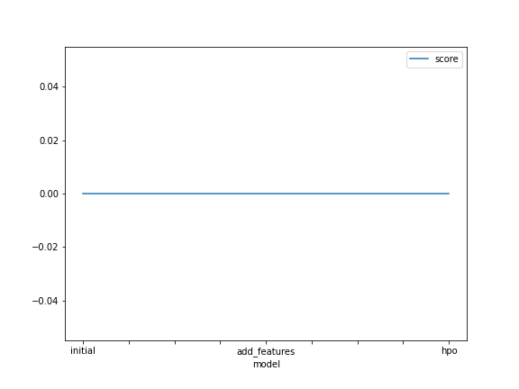

# Report: Predict Bike Sharing Demand with AutoGluon Solution
#### Osama Khedr

## Initial Training
### What did you realize when you tried to submit your predictions? What changes were needed to the output of the predictor to submit your results?
Predictions can't be negative, so any negative values were converted to zero.

### What was the top ranked model that performed?
The best model is LightGBM_BAG_L2/T2 with a score_val of -36.017982.

## Exploratory data analysis and feature creation
### What did the exploratory analysis find and how did you add additional features?
I found that date can be split into further features, since date is mostly the most important aspect while predicting bike sharing demand, pandas facilitates dealing with datetime objects.

### How much better did your model preform after adding additional features and why do you think that is?
significantly better, about 161% decrease in error from the original model.

## Hyper parameter tuning
### How much better did your model preform after trying different hyper parameters?
it did much better, approximately 36% decrease in error from the added features model. 

### If you were given more time with this dataset, where do you think you would spend more time?
I think feature engineering will be crucial if it's desired to increase the score.

### Create a table with the models you ran, the hyperparameters modified, and the kaggle score.
|model|hpo1|hpo2|hpo3|score|
|--|--|--|--|--|
|initial|default vals|default vals|default vals|1.80815
|add_features|default vals|default vals|default vals|0.68488
|hpo|'GBM':{'num_boost_round': 80, 'num_leaves':(lower=18, upper=48, default=32)|'XGB':{'max_depth':5'eta':0.2,'sampling_method':'gradient_based'}|default vals|0.50729
### Create a line plot showing the top model score for the three (or more) training runs during the project.

TODO: Replace the image below with your own.

### Create a line plot showing the top kaggle score for the three (or more) prediction submissions during the project.

TODO: Replace the image below with your own.

## Summary
The purpose of the project is to predict the bike sharing demand, that is: given a specific date with specific features, we want the model to predict the number of bikes that will be in demand,I used Autogluon to create a base model without any adjustments, it didn't do well, so I tried extracting more features without any hyperparameter optimization, it did significantly better. finally I tried hyperparameter optimization and the decrease in error was also significant, but I think the best way to improve the performance is working on the data by adding more records and feature engineering.
